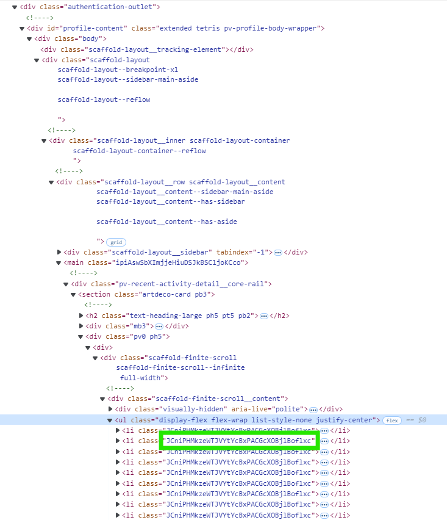

# Linkedin posts extractor

This is a Chrome extension that extracts posts from your LinkedIn feed and saves them as a JSON file. It's useful for data analysis or for creating a personalized feed for your LinkedIn feed.

## Installation

1. Clone this repository to your local machine.
2. Open Chrome and go to `chrome://extensions`.
3. Enable Developer Mode by clicking the toggle switch in the top right corner.
4. Click "Load Unpacked" and select the folder where you cloned the repository.
5. Look for the identifier used with the Chrome inspect functionality

6. Change in the code with yours

## Usage

1. Open your LinkedIn profile.
2. Scroll down to load the posts you want to extract.
3. Click the extension icon in the top right corner.
4. Wait for the script to finish extracting your posts.
5. The extracted posts will be saved as a JSON file in your downloads folder.

## Extracted Data

The extracted data includes the following fields:

- `content`: The text content of the post.
- `reactions`: The number of reactions to the post.
- `comments`: The number of comments on the post.
- `impressions`: The number of impressions (views) on the post.

The script will skip any posts that are reposts or have a small text content. (under 100 characters)

## Contributing

Contributions are welcome! If you find any bugs or have suggestions for improvements, please open an issue or submit a pull request on the GitHub repository.

## License

This project is licensed under the MIT License. See the LICENSE file for details.
